This is a tutorial over various clustering methods: K-Means, Hierachical clustering, Gaussian mixture models, use kernel to construct a similarity graph + Spectral Clustering; and lastly, DB-SCAN

Exploratory analysis
--------------------

    (headers <- colnames(x1)) # variable names

    ##  [1] "libertarian"      "govtrust"         "polcynicism"     
    ##  [4] "postmat"          "authoritarian"    "tolerance"       
    ##  [7] "freespeech"       "reactance"        "internationalism"
    ## [10] "interventionism"  "mediatrust"       "fatalism"        
    ## [13] "multiculture"     "sci_reli"         "conspiracy"      
    ## [16] "collectivism"     "individualism"

    # asymmetry
    for( i in 1:length(headers)){
        hist(x1[,i] ,breaks = 20, main = headers[i])
        abline(v=median(x1[,i]), col="red")
        # cat ("Press [enter] to continue or [no|No] key to break")
        # line <- readline()
        # if (line == 'no' | line == 'No'){
        #     break
        # }
    }

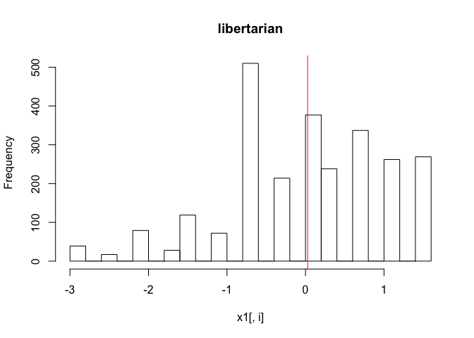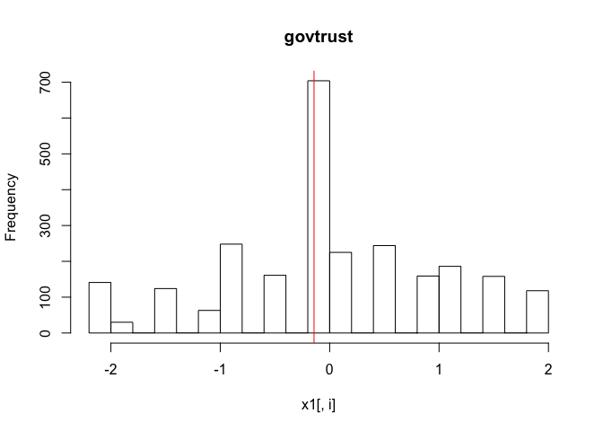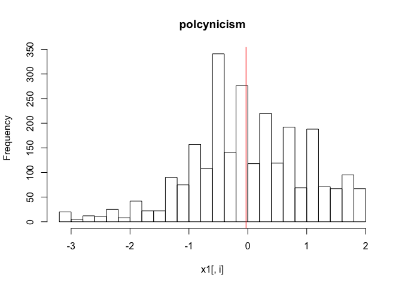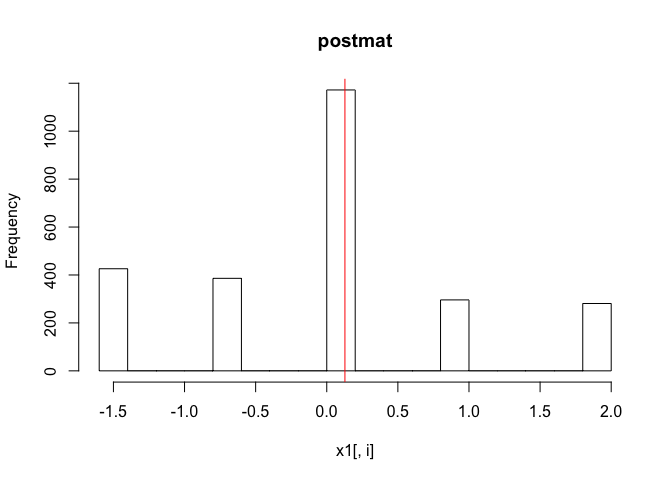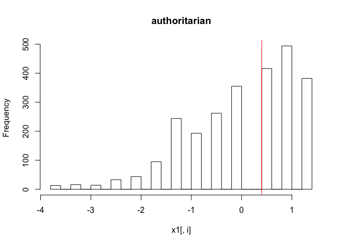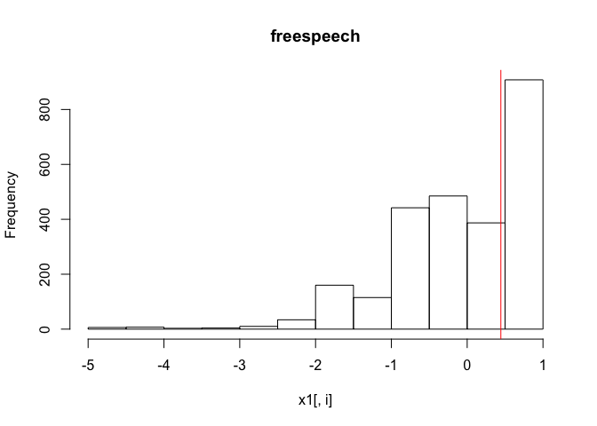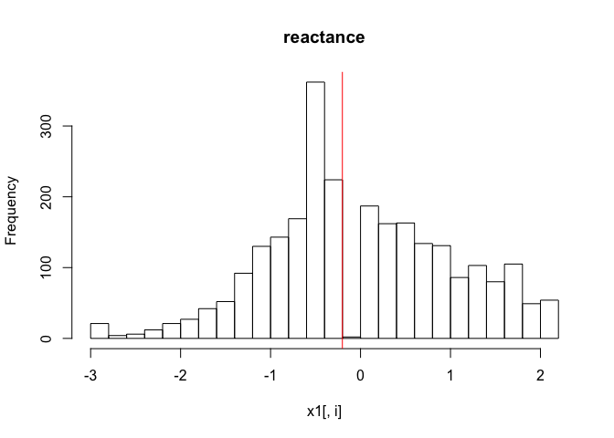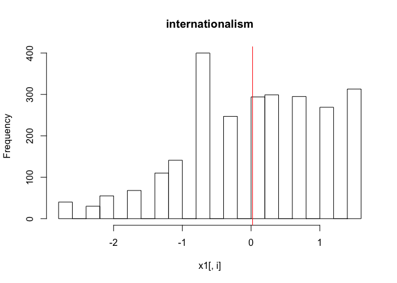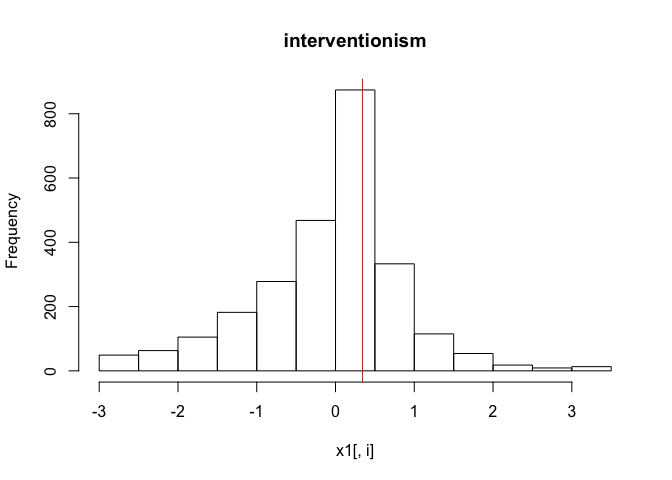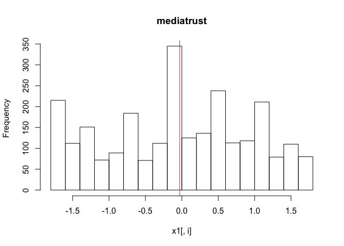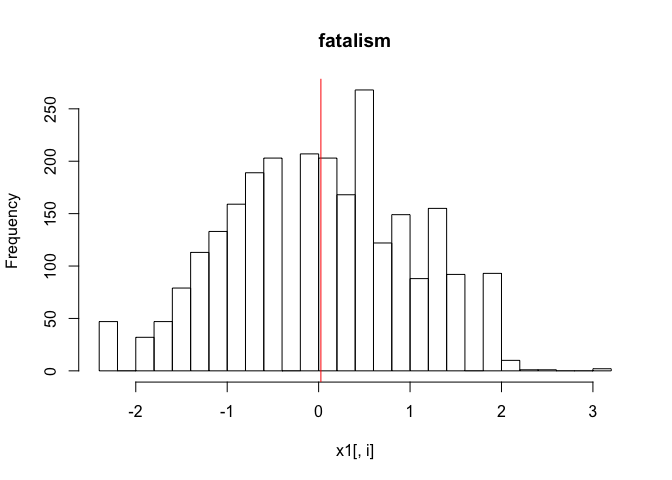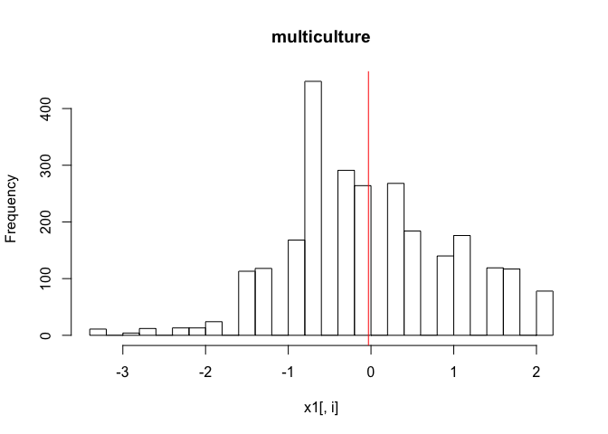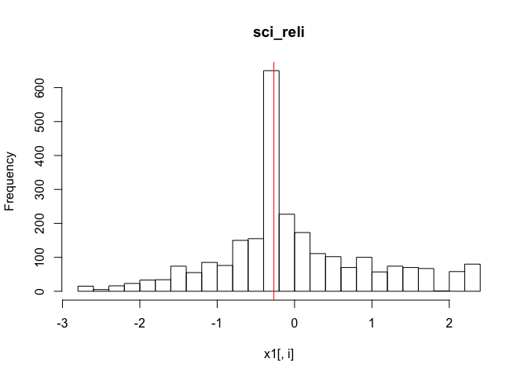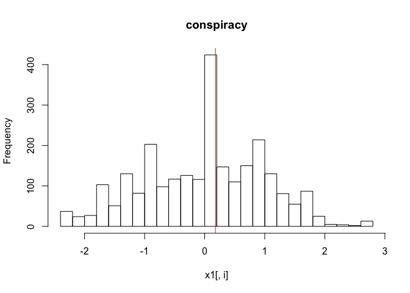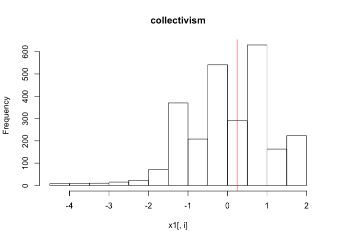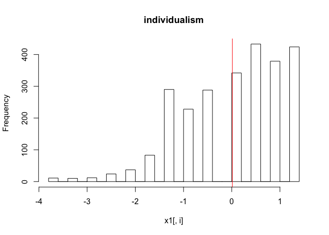

    par(mar = c(3, 8, 4, 2) + 0.1)
    boxplot(data1, horizontal = T, las = 1, main = "before scaling")

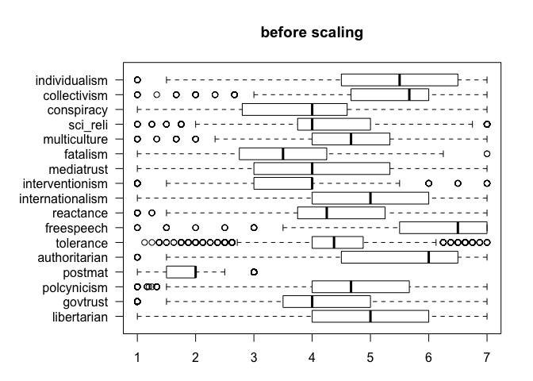

    boxplot(x1, horizontal = T, las = 1, main = "after scaling, mean = 1, sd = 1")

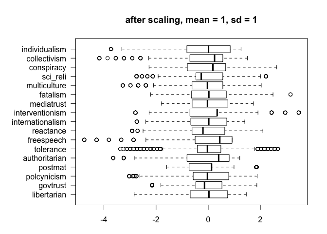

    #boxplot(as.matrix(x1), horizontal = T, las = 1, main = "after scaling, mean = 1, sd = 1")
    par(mar = c(5, 4, 2, 3) + 0.1)

    #correlation among variables
    cov <- cor(data1)
    cov[ row(cov) < col(cov)] <- 0; which(abs(cov) > 0.5, arr.ind = T)

    ##                  row col
    ## libertarian        1   1
    ## govtrust           2   2
    ## mediatrust        11   2
    ## multiculture      13   2
    ## polcynicism        3   3
    ## postmat            4   4
    ## authoritarian      5   5
    ## tolerance          6   6
    ## freespeech         7   7
    ## reactance          8   8
    ## internationalism   9   9
    ## interventionism   10  10
    ## mediatrust        11  11
    ## multiculture      13  11
    ## fatalism          12  12
    ## multiculture      13  13
    ## sci_reli          14  14
    ## conspiracy        15  15
    ## collectivism      16  16
    ## individualism     17  17

    balloon.plot(cov, rowlabel = headers, collabel = headers)

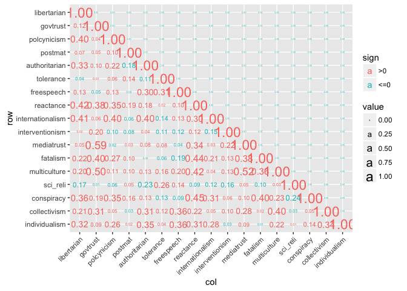 \#\# k -
means how many clusters?

    k = 1:20
    wss <- rep(0,20)
    xm <- colMeans(x1)
    wss[1] = sum(x1^2)- nrow(x1)*sum(xm^2)

    for(i in 2:20){
        model <- kmeans(x1, centers = i, nstart =20, iter.max = 30)
        wss[i] <- sum(model$withinss)
    }
    plot(wss, type ="b"); abline(v=6, col ="red", lty =2)

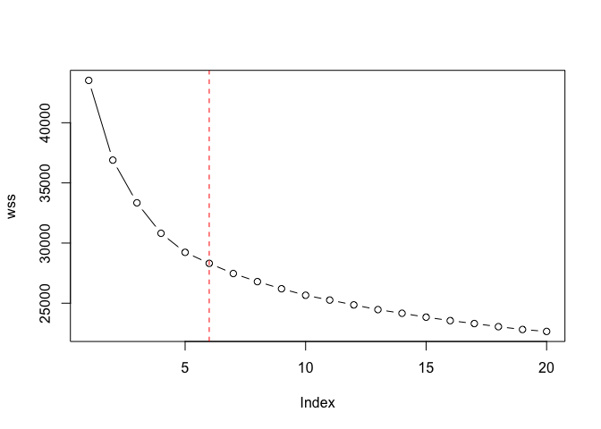

    k = 9
    set.seed(100)
    km1 <- kmeans(x1, k, nstart =  100, iter.max = 30)
    ord <- order(km1$centers[,1], decreasing = T)
    km1 <- kmeans(x1, centers = km1$centers[ord,], nstart =  1, iter.max = 30)
    km1$size

    ## [1] 289 291 185 267 341 257 297 355 279

    Z <-matrix(0, nNodes, k )
    for ( i in 1:k){ Z[km1$cluster ==i, i ] <- 1}
    NZ <- Z %*% Diagonal(k, km1$size^(-1)) 
    Dmat <- as.matrix(dist(x = x1))
    Bmat <- t(NZ) %*% Dmat %*% NZ

    ggplot(melt(as.matrix(Bmat)), 
           aes(x=as.factor(X1), y= as.factor(X2), fill=value)) + 
        geom_tile()+ labs(title = "Avg.Distances of Points in/out Cluster(K-means)") + xlab("") + ylab("")

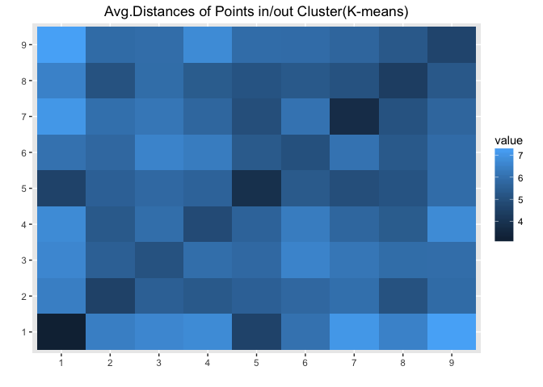

    plt.centers(x1, km1$cluster)

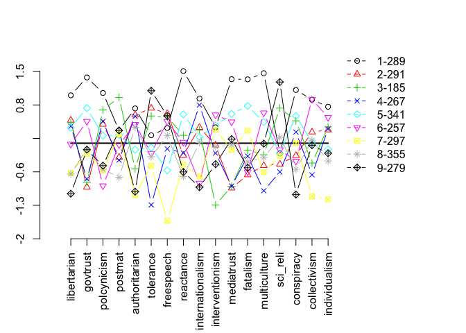

    q1 <- plt.mds(mds_fit$points, km1$cluster, xlabel = "MDS Coordinate 1", 
            ylabel = "MDS Coordinate 2", main_title = "clusters in low dimension (Kmeans)")
    q1

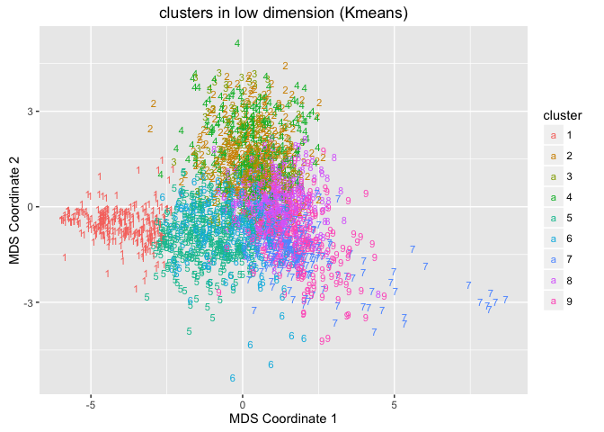

hirachical clustering
---------------------

    stree <- hclust(dist(x1),method  ="complete")
    plot(stree, labels = rep("",nNodes), ylab ="Distance", 
         main="Complete Linkages")
    m <- length(stree$height)
    k = 5 # number of clusters
    ht <- 0.5*(stree$height[m-k+1]+stree$height[m-k+2]); 
    abline(h=ht,lty=2, col ="red")

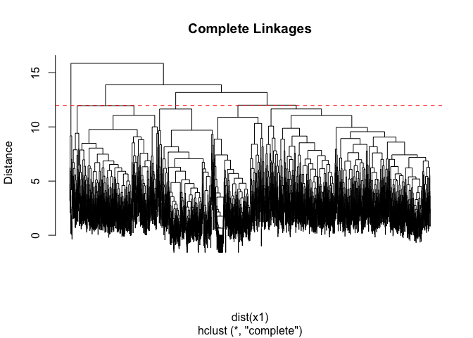

    hlabs <- cutree(stree, h =  ht); table(hlabs)

    ## hlabs
    ##    1    2    3    4    5 
    ##  395 1170   17  366  613

    plt.centers(x1, hlabs)

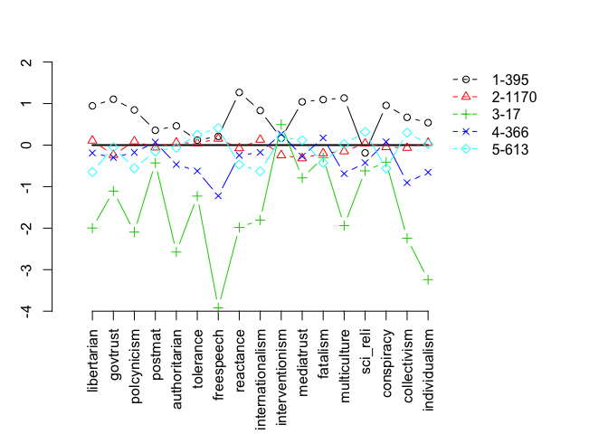

    q2 <- plt.mds(mds_fit$points, hlabs, xlabel = "MDS Coordinate 1", 
            ylabel = "MDS Coordinate 2", main_title = "clusters in low dimension(Hierachical)")
    q2

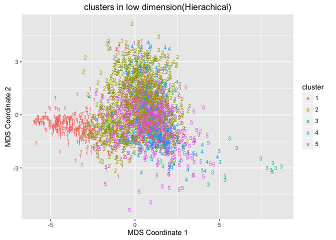

Gaussian mixture clustering, up to 9 clusters by default
--------------------------------------------------------

    library(mclust)

    ## Package 'mclust' version 5.2

    ## Type 'citation("mclust")' for citing this R package in publications.

    mclus <- Mclust(x1, G = k )  
    mlabs<- mclus$classification
    plot(x =mds_fit$points[,1], y = mds_fit$points[,2], xlab="Coordinate 1", ylab="Coordinate 2",  type = 'n', main = "Hierachical Clustering")
    text(x= mds_fit$points[,1], y = mds_fit$points[,2], labels = mlabs, col = mlabs, cex=.7)

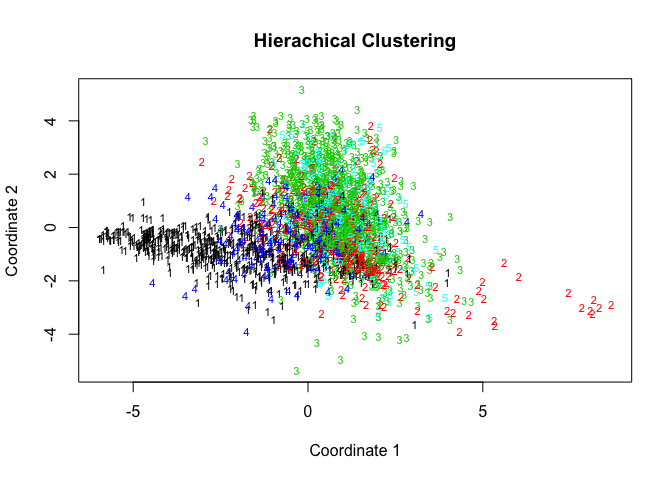

    plt.centers(x1, labs = mlabs )

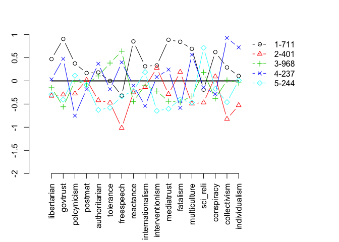

    q3 <- plt.mds(mds_fit$points, mlabs, xlabel = "MDS Coordinate 1", 
            ylabel = "MDS Coordinate 2", main_title = "clusters in low dimension (GMM)")
    q3

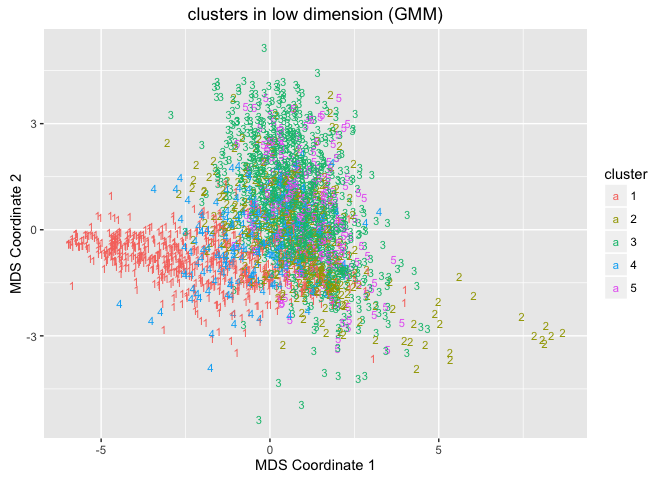

spectral clustering -using kernel to construct a similarity graph
-----------------------------------------------------------------

    # weighted graph
    distM <-as.matrix(dist(x1))
    s = quantile(distM, 0.05)
    S <- exp(- distM/s); diag(S) <- 0
    D <- rowSums(S)
    L <- Diagonal(nNodes, (1+D)^(-1/2)) %*% S%*% Diagonal(nNodes, (1+D)^(-1/2))
    svd1 <- irlba::irlba(L, nv = 20)
    plot(svd1$d)

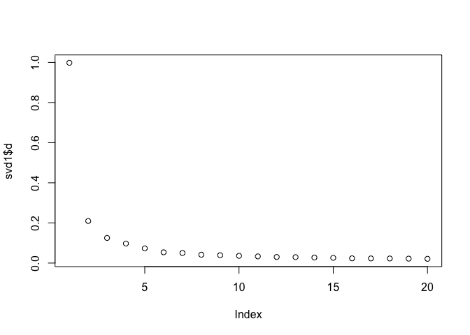

    k = 6
    U <- svd1$u[,1:k]; rowN <- sqrt(rowSums(U*U) +1e-6); 
    U1 <- Diagonal(nNodes, rowN^(-1)) %*% U
    km2 <- kmeans(U1, k, iter.max = 30, nstart = 30 )

    plt.centers(x1, km2$cluster)

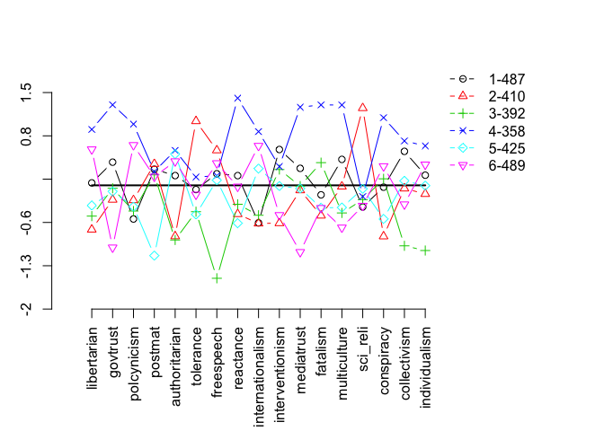

    q4<-  plt.mds(mds_fit$points, km2$cluster, xlabel = "MDS Coordinate 1", 
            ylabel = "MDS Coordinate 2", main_title = "clusters in low dimension")
    q41 <- plt.mds(U1[,2:3], km2$cluster, xlabel = "SC -2 ", 
            ylabel = "SC-3", main_title = "clusters in low dimension(SC-weighted)")
    q4 

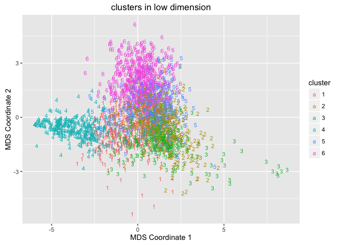

    q41

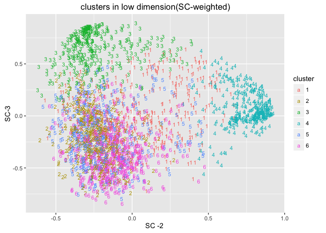

spectral clustering -- kernel similarity, truncated
---------------------------------------------------

    distM <-as.matrix(dist(x1)); s = quantile(distM, 0.05)
    S <- exp(- distM/s); diag(S) <- 0
    A <- matrix(0, nNodes, nNodes); 
    eps = quantile(S, 0.96) # 95% sparse, 50 edges
    for( i in 1:nNodes ){
        #A[i, S[i,]>eps] <- 1
        A[i, order(-S[i,])[1:10]]<-1
    }
    diag(A) <- 0
    A <- 1* (A+t(A)>0)
    D <- rowSums(A)
    L <- Diagonal(nNodes, (D+1)^(-1/2)) %*% A %*% Diagonal(nNodes, (D+1)^(-1/2))
    svd1 <- irlba(L, nv = 20)
    plot(svd1$d); abline(v = 6, col ="red", lty=2)

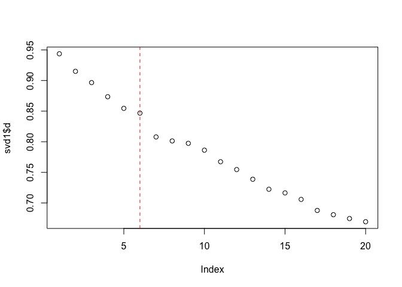

    k=6
    U <- svd1$u[,1:k]; rowN <- sqrt(rowSums(U*U) +1e-6); U1 <- Diagonal(nNodes, rowN^(-1)) %*% U
    km2 <- kmeans(U1, k, iter.max = 30, nstart = 30 )

    plt.centers(x1, km2$cluster)

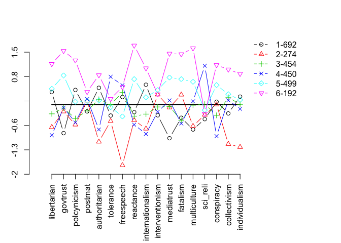

    q5 <- plt.mds(mds_fit$points, km2$cluster, xlabel = "MDS Coordinate 1", 
            ylabel = "MDS Coordinate 2", main_title = "clusters in low dimension(SC-kernel-truncated)")

    q51 <- plt.mds(U1[,2:3], km2$cluster, xlabel = "2nd Eigenvector",
            y= "3rd Eigenvector", main_title = "clusters in low dimension(SC-kernel-truncated)")
    q5

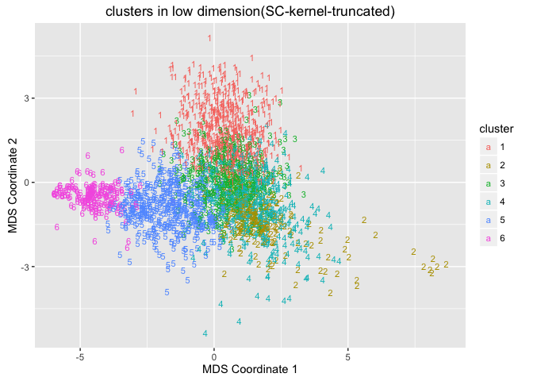

    q51

dbscan -- use density, doesn't work in this problem
------

    # dbscan(x, eps, minPts = 5, weights = NULL,
    #        borderPoints = TRUE, search = "kdtree", bucketSize = 10,
    #        splitRule = "suggest", approx = 0, ...)
    # eps :size of the epsilon neighborhood.
    # minPts
    library(dbscan)
    x.pca <- princomp(x1)
    db <- dbscan(x.pca$scores[,1:4], eps = 0.5)
    db

    ## DBSCAN clustering for 2561 objects.
    ## Parameters: eps = 0.5, minPts = 5
    ## The clustering contains 35 cluster(s) and 1610 noise points.
    ## 
    ##    0    1    2    3    4    5    6    7    8    9   10   11   12   13   14 
    ## 1610  390  315   13    7    6   44    5    6    7    6    3    7    5    4 
    ##   15   16   17   18   19   20   21   22   23   24   25   26   27   28   29 
    ##    8    5    4    9    9    6    5    8    5    9    2   10   10    5    4 
    ##   30   31   32   33   34   35 
    ##    7    5    6    6    5    5 
    ## 
    ## Available fields: cluster, eps, minPts

    db <- dbscan(x.pca$scores[,1:4], eps = 0.4)
    db

    ## DBSCAN clustering for 2561 objects.
    ## Parameters: eps = 0.4, minPts = 5
    ## The clustering contains 29 cluster(s) and 2192 noise points.
    ## 
    ##    0    1    2    3    4    5    6    7    8    9   10   11   12   13   14 
    ## 2192   23   13   91    5   60    5   14    7   12    5    7   12   12   14 
    ##   15   16   17   18   19   20   21   22   23   24   25   26   27   28   29 
    ##   10    7    7    5    7    6    5    4    7    5    5    5    6    5    5 
    ## 
    ## Available fields: cluster, eps, minPts

    db <- dbscan(x.pca$scores[,1:4], eps = 0.3)
    db

    ## DBSCAN clustering for 2561 objects.
    ## Parameters: eps = 0.3, minPts = 5
    ## The clustering contains 6 cluster(s) and 2465 noise points.
    ## 
    ##    0    1    2    3    4    5    6 
    ## 2465    6   53   14    7    9    7 
    ## 
    ## Available fields: cluster, eps, minPts

    db <- dbscan(x.pca$scores[,1:4], eps = 0.2)
    db

    ## DBSCAN clustering for 2561 objects.
    ## Parameters: eps = 0.2, minPts = 5
    ## The clustering contains 3 cluster(s) and 2510 noise points.
    ## 
    ##    0    1    2    3 
    ## 2510   41    5    5 
    ## 
    ## Available fields: cluster, eps, minPts

    db <- dbscan(x.pca$scores[,1:4], eps = 0.1)
    db

    ## DBSCAN clustering for 2561 objects.
    ## Parameters: eps = 0.1, minPts = 5
    ## The clustering contains 1 cluster(s) and 2528 noise points.
    ## 
    ##    0    1 
    ## 2528   33 
    ## 
    ## Available fields: cluster, eps, minPts

    plt.centers(x1, db$cluster)

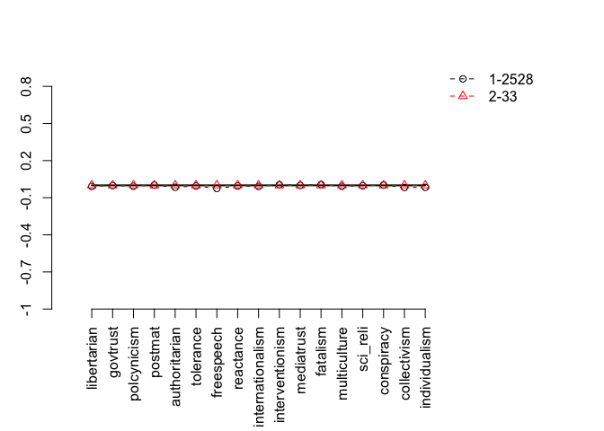

    q6 <- plt.mds(mds_fit$points, db$cluster, xlabel = "MDS Coordinate 1", 
            ylabel = "MDS Coordinate 2", main_title = "clusters in low dimension(DB-SCAN)")
    q6

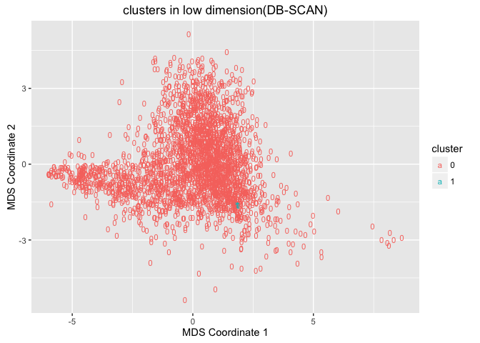
