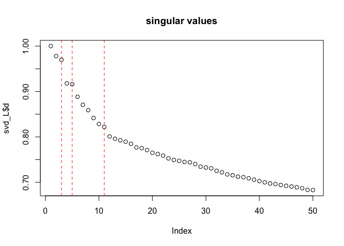
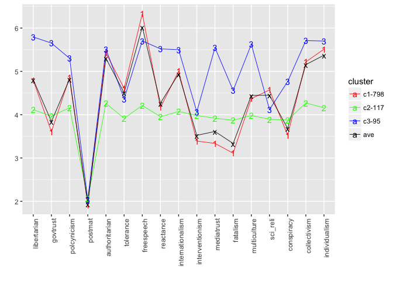
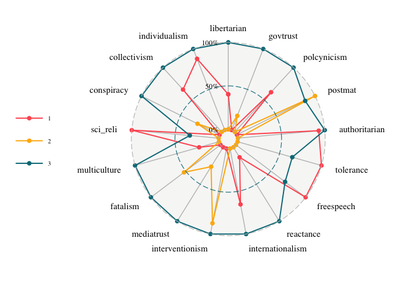
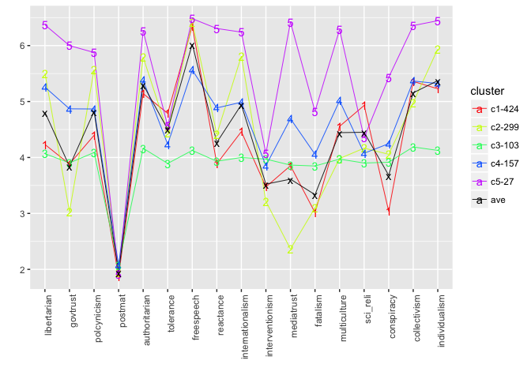
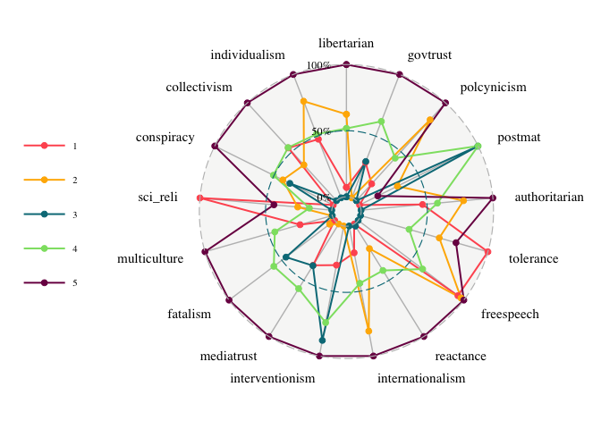
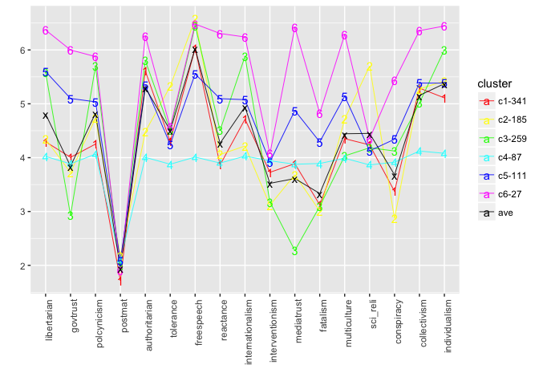
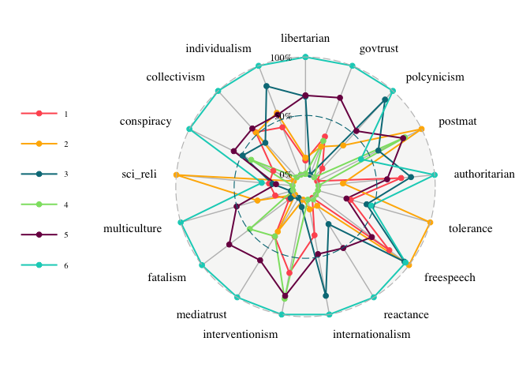
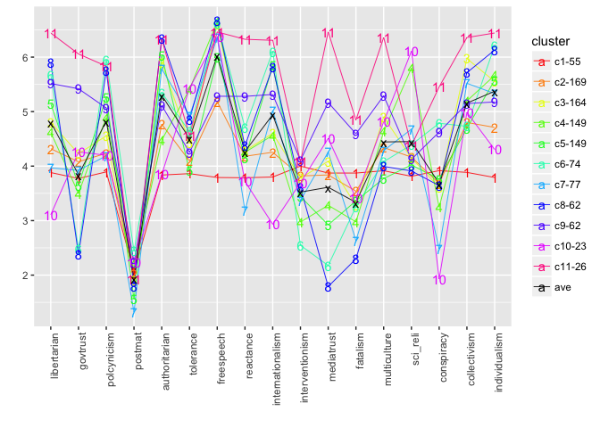
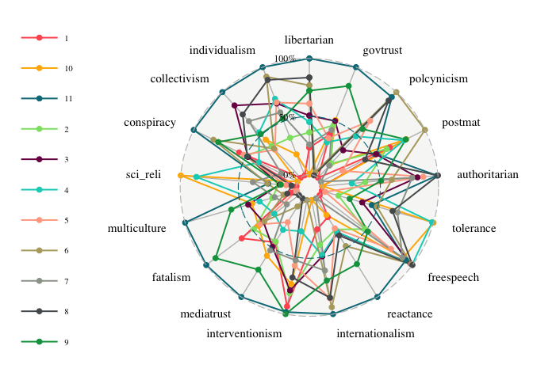

readin Data
-----------

    rm(list =ls())
    library(tidyverse)
    library(Matrix)
    library(ggradar)
    library(scales)
    library(igraph)
    source("ideology_functions.R")

    # row and column normalization
    # 3rd stage cluster analysis

    full <- memisc::as.data.set(
        memisc::spss.system.file('../MCRC1617_CLUSTER ID AND DESCRIPTIVE VARS.sav'))
    full <- as.data.frame(full)
    dim(full)

    ## [1] 2582  119

    #unscaled, full data set, self-identified party
    originalData <- full[,c(85,94:110)]

    # missingness
    missing <- lapply( originalData, function(x) which(is.na(x)) ) 
    missing_ids <- unique( unlist(missing))
    cat(length(missing_ids),  "out of", nrow(originalData), "contains missing values") #21

    ## 33 out of 2582 contains missing values

    missed <- originalData[missing_ids,]

    #complete cases
    data1 <- originalData[-missing_ids,]

    data1[1033,]

    ##                 party_iden libertarian govtrust polcynicism postmat
    ## 1044 Other political party           4        4           4       2
    ##      authoritarian tolerance freespeech reactance internationalism
    ## 1044             4         4          4         4                4
    ##      interventionism mediatrust fatalism multiculture sci_reli conspiracy
    ## 1044               4          4        4            4        4          4
    ##      collectivism individualism
    ## 1044            4             4

    party <- data1$party_iden

    leans <- which((party == 'Lean Republican') + (party == 'Lean Democrat') > 0)
    independent <- which(party == 'Independent')
    Extened_independent <- c(leans, independent)

    data1 <- data1[Extened_independent, 2:18]
    x1 = scale(data1)        

Spectral clustering
-------------------

    ## [1] 10154

    ## [1] 9144

    ## [1] 1010 1010

clustering results
------------------

    load("./result_sc.RData")

    k = 3
    labs = cluster_sc[,k] 

    #line plot
    plt.centers(as.matrix(data1), labs)

    k = length(unique(labs))
    m <- dim(x1)[2]
    nNodes <- length(labs)
    Z <- membershipM(labs)
    NZ <- Z %*% Diagonal(k, colSums(Z)^(-1)) 
    centers <- t(NZ)%*%as.matrix(data1)

    centers_radar <- data.frame(as.matrix(centers)) %>% 
        rownames_to_column(var= "group") %>% mutate_at(.funs = rescale, 
                                                       .vars = 2:(ncol(centers)+1))

    ggradar(centers_radar, font.radar="Times",axis.label.size=4, group.point.size=2, group.line.width=0.7,grid.label.size=4,grid.line.width=0.4,legend.text.size=8)

    k = 5
    labs = cluster_sc[,k] 

    #line plot
    plt.centers(as.matrix(data1), labs)

    k = length(unique(labs))
    m <- dim(x1)[2]
    nNodes <- length(labs)
    Z <- membershipM(labs)
    NZ <- Z %*% Diagonal(k, colSums(Z)^(-1)) 
    centers <- t(NZ)%*%as.matrix(data1)
    centers_radar <- data.frame(as.matrix(centers)) %>% 
        rownames_to_column(var = "group") %>% mutate_at(.funs = rescale, 
                                                       .vars = 2:(ncol(centers)+1))

    library(ggradar)
    ggradar(centers_radar, font.radar="Times",axis.label.size=4, group.point.size=2, group.line.width=0.7,grid.label.size=4,grid.line.width=0.4,legend.text.size=8)

    k = 6
    labs = cluster_sc[,k] 

    #line plot
    plt.centers(as.matrix(data1), labs)

    k = length(unique(labs))
    m <- dim(x1)[2]
    nNodes <- length(labs)
    Z <- membershipM(labs)
    NZ <- Z %*% Diagonal(k, colSums(Z)^(-1)) 
    centers <- t(NZ)%*%as.matrix(data1)
    centers_radar <- data.frame(group = 1:k, as.matrix(centers)) %>% 
         mutate_at(.funs = rescale, 
                                                       .vars = 2:(ncol(centers)+1))

    ggradar(centers_radar, font.radar="Times",axis.label.size=4, group.point.size=2, group.line.width=0.7,grid.label.size=4,grid.line.width=0.4,legend.text.size=8)

    k = 11
    labs = cluster_sc[,k] 

    #line plot
    plt.centers(as.matrix(data1), labs)

    k = length(unique(labs))
    m <- dim(x1)[2]
    nNodes <- length(labs)
    Z <- membershipM(labs)
    NZ <- Z %*% Diagonal(k, colSums(Z)^(-1)) 
    centers <- t(NZ)%*%as.matrix(data1)
    centers_radar <- data.frame(group = as.factor(1:k), as.matrix(centers)) %>%  
        mutate_at(.funs = rescale, .vars = 2:(ncol(centers)+1))
    library(ggradar)
    ggradar(centers_radar, font.radar="Times", axis.label.size=4, group.point.size=2, group.line.width=0.7, grid.label.size=4, grid.line.width=0.4,legend.text.size=8)

