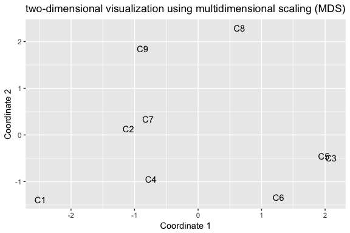

# report_0926
Song Wang  
9/26/2017  


```r
membership <- read.csv("membership9.csv")
idx <- which(!is.na(membership$membership))
idx1 <- match(as.character(membership$id[idx]), rownames(x1))
x1 <- x1[idx1,]
dat <- membership[idx,]
dat <- data.frame(id = dat$id, cluster =dat$membership, x1)
dat$polengage <- full$polengage[idx1]
dat$ideo_soc <- full$ideo_soc[idx1]
dat$ideo_eco <- full$ideo_eco[idx1]


#(1) Pragmatic Progressives (N = 238) , (2) Anti-Establishment Liberals (N = 211), (3) Engaged Floaters (N = 196), (4) Patriotic Liberals (N = 301), (5) Mainstream Liberals (N = 361), (6) Disengaged Isolates (N = 204), (7) Disengaged Floaters (N = 341), (8) Anti-Establishment Conservatives (N = 347), (9) Mainstream Conservatives (N = 350).

newlabel <- data.frame(cluster1 = 1:9, cluster = c(9,5,4,6,3,7,8,2,1), 
                      cluster_label = c("Pragmatic Progressives (N = 238)","Anti-Establishment Liberals (N = 211)", "Institutionalized Liberals (N = 196)", "Patriotic Liberals (N = 301)", "Mainstream Liberals (N = 361)", "Ambivalent Floaters (N = 204)", "Disengaged Floaters (N = 341)", "Anti-Establishment Conservatives (N = 347)", "Mainstream Conservatives (N = 350)") )

#newlabel <- newlabel[order(newlabel$cluster0),]

df <- dat %>% left_join(newlabel, by = c("cluster" = "cluster")) 
#cluster1 is the new lable id, and the corresponding label
df <- df[, -match("cluster", colnames(df))]
df <- df[,c(1,22,23,2:21)]
names(df)[2] <-"cluster"

full$cluster <- rep(NA, nrow(full))
full$cluster[-missing_ids] <- df$cluster
full$cluster_label <- rep(NA, nrow(full))
full$cluster_label[-missing_ids] <- df$cluster_label


#newlabel$cluster_label1 <- gsub(" \\(N = (\\d+)\\)", "(\\1)", newlabel$cluster_label)
newlabel$cluster_label1 <- gsub(" \\(N = (\\d+)\\)", "", newlabel$cluster_label)
df$cluster_label1 <- factor(df$cluster, 1:9, labels = newlabel$cluster_label1)
```


### Part 1, visualize the centers


```r
Z <- membershipM(df$cluster)
NZ <- Z %*% diag(colSums(Z)^(-1)) 
centers <- t(NZ)%*%x1
base = colMeans(x1)
#centers = rbind(centers, base)
#centers <- data.frame(centers)
#centers$cluster <- 1:10
#centers <- centers %>% left_join(newlabel, by = c("cluster" = "cluster0"))
k=9
p1.data <- data.frame(cluster_id = rep(1:k, times =ncol(x1)), 
                        variable = rep(1:ncol(x1), each = k),
                        values = as.vector(as.matrix(centers)))
p1.data$variable <- as.factor(p1.data$variable)
p1.data$variable <- factor(p1.data$variable,levels = 1:ncol(x1), labels = colnames(x1) )
p1.data$cluster_factor <- as.factor(p1.data$cluster_id)

p1.data$cluster_label <- factor(p1.data$cluster_id,1:k, paste0('c',1:k,'-',colSums(Z)))
p1.data$group<- rep(1, nrow(p1.data))

# p1.data$group[p1.data$cluster_id >= 4] <- 2;p1.data$group[p1.data$cluster_id >= 7] <- 3
# p1.data$group <- factor(p1.data$group, levels = 1:3, labels = c("1-3","4-6","7-9"))
# p1.data$cluster_id <- as.factor(p1.data$cluster_id %% 3+1) #1,2,3 within each frame


p1.data$group[p1.data$cluster_id >= 3] <- 2;
p1.data$group[p1.data$cluster_id >= 6] <- 3;
p1.data$group[p1.data$cluster_id >= 8] <- 4
p1.data$group <- factor(p1.data$group, levels = 1:4, labels =
                            c("Unaffiliated liberals","Affiliated liberal","Independents","Conservatives"))
p1.data$cluster_id <- p1.data$cluster_id #1,2,3 within each frame
p1.data$cluster_id[p1.data$cluster_id==3] <-1;
p1.data$cluster_id[p1.data$cluster_id==4] <-2
p1.data$cluster_id[p1.data$cluster_id==5] <-3;
p1.data$cluster_id[p1.data$cluster_id==6] <-1
p1.data$cluster_id[p1.data$cluster_id==7] <-2;
p1.data$cluster_id[p1.data$cluster_id==8] <-1;
p1.data$cluster_id[p1.data$cluster_id==9] <-2
p1.data$cluster_id <- as.factor(p1.data$cluster_id)


p1.data %>% ggplot(aes(x = variable, y = values)) + 
        #geom_point(aes(shape = cluster_id)) + 
        #scale_shape_manual(values = c(0,1,2))+
        geom_line(aes(group = cluster_factor, linetype = cluster_id), size = 0.5 )+
        geom_text(aes(label = cluster_factor),size = 3) +
        theme(axis.text.x = element_text(angle = 30, hjust = 1, size =7)) + 
        labs(y = "standarized scores", x ="17 indices used for clustering") + facet_grid(group~.)+theme(strip.text = element_text(size=6), legend.position="none")
```

<!-- -->
**Figure 1.** line plot


```r
balloon.plot2(as.matrix(centers)[-10,], 
             xlabel = colnames(centers), 
             ylabel = newlabel$cluster_label)+
    #geom_text(size = 5)+
    theme(text = element_text(size=10),
        axis.text.x = element_text(angle=45, hjust=1))+theme(legend.position="none")
```

<!-- -->

```r
write.csv(centers, file ="../report/report_09_30/centers9.csv", row.names = F)
```
**Figure 2.** the means for standardized scores, correponding to line plots


```r
x1.tmp <- data.frame(x1); x1.tmp$cluster <- df$cluster
t.values <- x1.tmp %>% summarise_all(.funs = c("mean", "sd")) 
p2.data1 <- x1.tmp %>% group_by(cluster) %>%
    summarise_all(.funs = c(Mean="mean",Sd="sd",rep ="length"))
p2.data <- p2.data1[,1:18]
p2.data[,2:18] <- p2.data1[,2:18]/p2.data1[19:35]*sqrt(p2.data1[36:52])
balloon.plot2(as.matrix(p2.data[,2:18]), xlabel = colnames(centers), 
             ylabel = newlabel$cluster_label) + theme(legend.position="none")
```

<!-- -->

```r
write.csv(p2.data, file ="../report/report_09_30/t_values.csv", row.names = F)
```
**Figure 3.** The table of t values 


```r
dat$label <- dat$cluster
dat$label <- factor(dat$label, levels = 1:9, labels = c("Pragmatic Progressives (N = 238)","Anti-Establishment Liberals (N = 211)", "Engaged Floaters (N = 196)", 
"Patriotic Liberals (N = 301)", "Mainstream Liberals (N = 361)", "Disengaged Isolates (N = 204)", "Disengaged Floaters (N = 341)", "Anti-Establishment Conservatives (N = 347)", "Mainstream Conservatives (N = 350)"))
#dat$label1 <- dat$cluster
#dat$label1[dat$cluster %in% 1:5] <- "Liberal"
#dat$label1[dat$cluster %in% 6:7] <- "Floaters"
#dat$label1[dat$cluster %in% 8:9] <- "Conservatives"
```


### Part 2: K-means screen plot and distances among centers
-- I don't see clear indicator for K=9, i.e., there is no clear elbow point in the scree plot.

-- distance plots


```r
# k - means  how many clusters?
if (FALSE){
    k = 1:20
    wss <- rep(0,20)
    xm <- colMeans(x1)
    wss[1] = sum(x1^2)- nrow(x1)*sum(xm^2)
    set.seed(123)
    for(i in 2:20){
        model <- kmeans(x1, centers = i, nstart =200, iter.max = 30)
        wss[i] <- sum(model$withinss)
    }
    save(wss, file = "./kmeans_Scree.Data")
}


load("./kmeans_Scree.Data")
#setEPS()
#postscript("scree.eps")
par(mar = c(4,4,1,1))
plot(wss/wss[1], type ="b", xlab = "", 
     ylab = "")
text(9.8,0.53,labels = "k=9")
title(ylab="proportion of within cluster Sum of Squares", line=2, cex.lab=1)
title(xlab="number of clusters, k", line=2, cex.lab=1)
abline(v=9, col ="red", lty =2)
```

<!-- -->

```r
#dev.off()
```


```r
balloon.plot2(as.matrix(dist(centers)), xlabel = newlabel$cluster_label1, ylabel = newlabel$cluster_label1) +ggtitle("distance among the cluster centers")+theme(legend.position="none")+
    theme(axis.text.x = element_text(angle = 45, hjust = 1, size = 7))+
theme(axis.text.y = element_text(size = 7)) +theme(strip.text.x = element_text(size = 7,  angle = 90))
```

<!-- -->

```r
message("based on distances among means: ")
```

```
## based on distances among means:
```

```r
dist1 <- dist(centers)
fit1 <- cmdscale(dist1,k = 2)
tmp1 <- data.frame(fit1); names(tmp1) <- c("z1","z2"); 
tmp1$cluster = paste0("C", 1:9)
ggplot(tmp1, aes(x = z1, y = z2))+
      geom_text(aes(label =  cluster)) + 
      labs( x = "Coordinate 1", y = "Coordinate 2")+
      theme(plot.title = element_text(hjust = 0.5))+
      scale_color_manual(breaks = 1:k, values=c(rainbow(k)))+
      ggtitle("two-dimensional visualization using multidimensional scaling (MDS)")
```

<!-- -->

```r
dis2 <- t(NZ)%*% as.matrix(dist(x1)) %*% NZ #mean pair-wise distance
balloon.plot2(as.matrix(dis2), xlabel = newlabel$cluster_label1, ylabel = newlabel$cluster_label1) +ggtitle("mean pair-wise distance within/across clusters")+theme(legend.position="none")+
theme(axis.text.x = element_text(angle = 45, hjust = 1, size = 7))+
theme(axis.text.y = element_text( size = 7)) +
       theme(strip.text.x = element_text(size = 7,  angle = 90))
```

<!-- -->

```r
dist2 <- dis2
message("based on mean distances across clusters: ")
```

```
## based on mean distances across clusters:
```

```r
fit2 <- cmdscale(dist2,k = 2)
tmp2 <- data.frame(fit2); names(tmp2) <- c("z1","z2"); 
tmp2$cluster = paste0("C", 1:9)
ggplot(tmp2, aes(x = z1, y = z2))+
      geom_text(aes(label =  cluster)) + 
      labs( x = "Coordinate 1", y = "Coordinate 2")+
      theme(plot.title = element_text(hjust = 0.5))+
      scale_color_manual(breaks = 1:k, values=c(rainbow(k)))+
      ggtitle("two-dimensional visualization using multidimensional scaling (MDS)")
```

<!-- -->


### Part 3, ideology vs engagement plot


```r
#shape only has 6 values
df$polengage_factor <- df$polengage
df$polengage_factor[df$polengage>=1] <-1
df$polengage_factor[df$polengage>=2] <-2
df$polengage_factor[df$polengage>=3] <-3
df$polengage_factor[df$polengage>=4] <-4
df$polengage_factor[df$polengage>=5] <-5
#df$polengage_factor <- 6-df$polengage_factor
df$polengage_factor <- factor(df$polengage_factor, levels = 1:5, labels = 1:5)

#histogram or barplot
df %>% subset(!is.na(polengage)) %>% subset(!is.na(ideo_soc)) %>%
    mutate(cluster = as.factor(cluster)) %>%   ggplot(aes(ideo_soc)) +
      #geom_jitter(width =0.2, height = 0.2,shape=1)+
      geom_bar(aes(fill = polengage_factor), color ="black")+
      guides(fill = guide_legend(title = "engagement"))+
      scale_fill_brewer(palette="Greys")+
      #scale_color_manual(breaks = 1:5,
      #                  values=cc("gray0","gray75","gray50","gray25","gray1"))+
      facet_wrap(~cluster_label1, ncol = 3)+
      labs(y = "political engagement", x = "social ideology") +
      #theme_bw()+
      theme(axis.text.x = element_text(angle = 40, hjust = 1, size =7), strip.text = element_text(size=8)) #theme(legend.position="none")
```

<!-- -->

```r
#shape only has 6 values
df$polengage_factor <- df$polengage
df$polengage_factor[df$polengage>=1] <-1
df$polengage_factor[df$polengage>=2] <-2
df$polengage_factor[df$polengage>=3] <-3
df$polengage_factor[df$polengage>=4] <-4
df$polengage_factor[df$polengage>=5] <-5
#df$polengage_factor <- 6-df$polengage_factor
df$polengage_factor <- factor(df$polengage_factor, levels = 1:5, labels = 1:5)


df %>% subset(!is.na(polengage)) %>% subset(!is.na(ideo_soc)) %>%
    mutate(cluster = as.factor(cluster)) %>% ggplot(aes(ideo_soc)) +
      #geom_jitter(width =0.2, height = 0.2,shape=1)+
      geom_bar(position = "fill", aes( fill = polengage_factor), color ="black")+
      guides(fill = guide_legend(title = "engagement"))+
      scale_fill_brewer(palette="Greys")+
      #scale_color_manual(breaks = 1:5,
      #                  values=cc("gray0","gray75","gray50","gray25","gray1"))+
      facet_wrap(~cluster_label1, ncol = 3)+
      labs(y = "political engagement (%)", x = "social ideology") +
      #theme_bw()+
      theme(axis.text.x = element_text(angle = 40, hjust = 1, size =5),strip.text = element_text(size=8))
```

<!-- -->

```r
    #theme(legend.position="none")theme_bw

#df %>% mutate(cluster = as.factor(cluster)) %>% ggplot(aes(ideo_eco,polengage)) +
    #   geom_jitter(width =0.2, height = 0.2, shape=1)+
    #   #, aes(shape= cluster) scale_shape_manual(values = c(0:8))+
    # facet_wrap(~cluster_label1, ncol = 3)+
    #   labs(y = "political engagement", x = "ideo_eco") +
    #   theme(axis.text.x = element_text(angle = 45, hjust = 1, size = 5)) +
    #  theme(legend.position="none")
    # 


df %>% subset(!is.na(polengage)) %>% 
    subset(!is.na(ideo_soc)) %>%
    mutate(cluster = as.factor(cluster)) %>%   
    mutate(cluster = factor(cluster, levels = rev(levels(cluster)), labels = rev(newlabel$cluster_label1))) %>% ggplot(aes(cluster, jitter(polengage,0.2))) +
    #geom_bar(position = "fill",aes(fill = polengage_factor), color ="black")+
    #guides(fill = guide_legend(title = "engagement"))+
    #scale_fill_brewer(palette="Greys")+
    geom_boxplot()+
      coord_flip()+
      #scale_color_manual(breaks = 1:5,
      #                  values=cc("gray0","gray75","gray50","gray25","gray1"))+
      #facet_wrap(~cluster_label1, ncol = 3)+
      labs(y = "political engagement index (range:1-5)", x = "") +
      #theme_bw()+
      theme(axis.text.y = element_text(hjust = 1, size =8), strip.text = element_text(size=8)) +stat_summary(fun.y=mean, colour="black", geom="point", 
               shape=18, size=3,show.legend = FALSE)
```

<!-- -->

```r
df %>% subset(!is.na(polengage)) %>%group_by(cluster_label) %>% summarise
```

```
## # A tibble: 9 x 1
##                                cluster_label
##                                        <chr>
## 1              Ambivalent Floaters (N = 204)
## 2 Anti-Establishment Conservatives (N = 347)
## 3      Anti-Establishment Liberals (N = 211)
## 4              Disengaged Floaters (N = 341)
## 5       Institutionalized Liberals (N = 196)
## 6         Mainstream Conservatives (N = 350)
## 7              Mainstream Liberals (N = 361)
## 8               Patriotic Liberals (N = 301)
## 9           Pragmatic Progressives (N = 238)
```

```r
#p1+ geom_text(data = means, aes(label = cluster_label, x = cluster_label + 0.08))
```


### Part 4 Media Consumption


```r
ii1 <- match("media_nbc", colnames(full))
ii2 <- match("media_other", colnames(full))
media <- full[,c(ii1:ii2,120,121)]
media <- media[,-22]
media_m <- media %>% subset(!is.na(cluster)) %>% group_by(cluster) %>%
    summarise_all(mean)
media_m$n <- table(media$cluster)
media_m$cluster_label <- newlabel$cluster_label
media_m <- media_m[, c(1, 22:23, 2:21)]

media_libral <- read.csv("../data/outlets_by_type.csv", header = F)
ord <- order(media_libral$V4)
media_libral[ord,]
```

```
##                     V1       V2     V3     V4              V5
## 1  Talking Points Memo Very Lib Online -0.810       media_tpm
## 2      Huffington Post Very Lib Online -0.780  media_huffpost
## 3   Al Jazeera America                 -0.720       media_alj
## 4                  NPR Very Lib   Trad -0.700       media_npr
## 5                MSNBC Very Lib   Trad -0.670     media_msnbc
## 6                  PBS      Lib   Trad -0.630       media_pbs
## 7         The Guardian      Lib   Trad -0.610  media_guardian
## 8       New York Times      Lib   Trad -0.530       media_nyt
## 9      Washington Post      Lib   Trad -0.510      media_post
## 10                 NBC      Lib   Trad -0.500       media_nbc
## 11                 CNN      Lib   Trad -0.436       media_cnn
## 12            CBS News      Lib   Trad -0.310       media_cbs
## 13                 BBC      Lib   Trad -0.310       media_bbc
## 14            ABC News      Lib   Trad -0.240       media_abc
## 15           Bloomberg      Lib   Trad -0.240 media_bloomberg
## 16           USA Today    Mixed   Trad -0.190       media_usa
## 17 Wall Street Journal    Mixed   Trad  0.050       media_wsj
## 18            Fox News Very Con   Trad  0.850       media_fox
## 19           Breitbart Very Con Online  0.950 media_breitbart
```

```r
match(media_libral$V5, colnames(media))
```

```
##  [1]  9 18 11  2 19  4  5  3  8  1 16 15 12 10 13  6  7 17 14
```

```r
media_m <- media_m[,c(1:3, match(media_libral$V5, colnames(media_m)))]
colnames(media_m)[4:ncol(media_m)] <- paste0(media_libral$V1,"(",media_libral$V4,")")
k=9
p2.data <- data.frame(cluster_id = rep(1:k, times =19), 
                        variable = rep(1:19, each = k),
                        values = as.vector(as.matrix(media_m[,-c(1:3)])))
p2.data$variable <- as.factor(p2.data$variable)
p2.data$variable <- factor(p2.data$variable,levels = 1:19, labels = colnames(media_m)[4:22] )
p2.data$cluster_factor <- as.factor(p2.data$cluster_id)
p2.data$group <- rep(1, nrow(p2.data))
# p2.data$group[p2.data$cluster_id >= 4] <- 2;p2.data$group[p2.data$cluster_id >= 7] <- 3
# p2.data$group <- factor(p2.data$group, levels = 1:3, labels = c("1-3","4-6","7-9"))
# p2.data$cluster_id <- as.factor(p2.data$cluster_id %% 3+1) #1,2,3 within each frame

p2.data$group[p2.data$cluster_id >= 3] <- 2;
p2.data$group[p2.data$cluster_id >= 6] <- 3;
p2.data$group[p2.data$cluster_id >= 8] <- 4
p2.data$group <- factor(p2.data$group, levels = 1:4, labels =
                            c("Unaffiliated liberals","Affiliated liberal","Independents","Conservatives"))

p2.data$cluster_id <- p2.data$cluster_id #1,2,3 within each frame
p2.data$cluster_id[p2.data$cluster_id==3] <-1;
p2.data$cluster_id[p2.data$cluster_id==4] <-2
p2.data$cluster_id[p2.data$cluster_id==5] <-3;
p2.data$cluster_id[p2.data$cluster_id==6] <-1
p2.data$cluster_id[p2.data$cluster_id==7] <-2;
p2.data$cluster_id[p2.data$cluster_id==8] <-1;
p2.data$cluster_id[p2.data$cluster_id==9] <-2
p2.data$cluster_id <- as.factor(p2.data$cluster_id)
p2.data %>% ggplot(aes(x = variable, y = values)) + 
        #geom_point(aes(shape = cluster_id)) + 
        #scale_shape_manual(values = c(0,1,2))+
        #scale_y_log10(breaks = c(0.01,0.1,0.2,0.4,0.8), labels = c(0.01, 0.1,0.2,0.4,0.8)) +
        geom_line(aes(group = cluster_factor, linetype = cluster_id), size = 0.5 )+
        geom_abline(slope = 0,intercept = 1,size = 0.15)+
        #geom_abline(slope = 0,intercept = 1.5,size = 0.15)+
        geom_text(aes(label = cluster_factor),size = 3) +
        theme(axis.text.x = element_text(angle = 60, hjust = 1, size = 6)) + 
        labs(y = "consumption percentage daily", x ="") + facet_grid(group~.)+theme(strip.text = element_text(size=7), legend.position="none")
```

<!-- -->

```r
media_m <- media %>% subset(!is.na(cluster)) %>% group_by(cluster) %>%
    summarise_all(mean)
media_m$n <- table(media$cluster)
media_m$cluster_label <- newlabel$cluster_label
media_m <- media_m[, c(1, 22:23, 2:21)]

media_m[,4:23] <- as.matrix(media_m[,4:23]) %*% diag(colMeans(media_m[,4:23])^(-1))

media_libral <- read.csv("../data/outlets_by_type.csv", header = F)
ord <- order(media_libral$V4)
media_libral[ord,]
```

```
##                     V1       V2     V3     V4              V5
## 1  Talking Points Memo Very Lib Online -0.810       media_tpm
## 2      Huffington Post Very Lib Online -0.780  media_huffpost
## 3   Al Jazeera America                 -0.720       media_alj
## 4                  NPR Very Lib   Trad -0.700       media_npr
## 5                MSNBC Very Lib   Trad -0.670     media_msnbc
## 6                  PBS      Lib   Trad -0.630       media_pbs
## 7         The Guardian      Lib   Trad -0.610  media_guardian
## 8       New York Times      Lib   Trad -0.530       media_nyt
## 9      Washington Post      Lib   Trad -0.510      media_post
## 10                 NBC      Lib   Trad -0.500       media_nbc
## 11                 CNN      Lib   Trad -0.436       media_cnn
## 12            CBS News      Lib   Trad -0.310       media_cbs
## 13                 BBC      Lib   Trad -0.310       media_bbc
## 14            ABC News      Lib   Trad -0.240       media_abc
## 15           Bloomberg      Lib   Trad -0.240 media_bloomberg
## 16           USA Today    Mixed   Trad -0.190       media_usa
## 17 Wall Street Journal    Mixed   Trad  0.050       media_wsj
## 18            Fox News Very Con   Trad  0.850       media_fox
## 19           Breitbart Very Con Online  0.950 media_breitbart
```

```r
match(media_libral$V5, colnames(media))
```

```
##  [1]  9 18 11  2 19  4  5  3  8  1 16 15 12 10 13  6  7 17 14
```

```r
media_m <- media_m[,c(1:3, match(media_libral$V5, colnames(media_m)))]
colnames(media_m)[4:ncol(media_m)] <- paste0(media_libral$V1,"(",media_libral$V4,")")
k=9
p2.data <- data.frame(cluster_id = rep(1:k, times =19), 
                        variable = rep(1:19, each = k),
                        values = as.vector(as.matrix(media_m[,-c(1:3)])))
p2.data$variable <- as.factor(p2.data$variable)
p2.data$variable <- factor(p2.data$variable,levels = 1:19, labels = colnames(media_m)[4:22] )
p2.data$cluster_factor <- as.factor(p2.data$cluster_id)
p2.data$group <- rep(1, nrow(p2.data))
# p2.data$group[p2.data$cluster_id >= 4] <- 2;p2.data$group[p2.data$cluster_id >= 7] <- 3
# p2.data$group <- factor(p2.data$group, levels = 1:3, labels = c("1-3","4-6","7-9"))
# p2.data$cluster_id <- as.factor(p2.data$cluster_id %% 3+1) #1,2,3 within each frame

p2.data$group[p2.data$cluster_id >= 3] <- 2;
p2.data$group[p2.data$cluster_id >= 6] <- 3;
p2.data$group[p2.data$cluster_id >= 8] <- 4
p2.data$group <- factor(p2.data$group, levels = 1:4, labels =
                            c("Unaffiliated liberals","Affiliated liberal","Independents","Conservatives"))

p2.data$cluster_id <- p2.data$cluster_id #1,2,3 within each frame
p2.data$cluster_id[p2.data$cluster_id==3] <-1;
p2.data$cluster_id[p2.data$cluster_id==4] <-2
p2.data$cluster_id[p2.data$cluster_id==5] <-3;
p2.data$cluster_id[p2.data$cluster_id==6] <-1
p2.data$cluster_id[p2.data$cluster_id==7] <-2;
p2.data$cluster_id[p2.data$cluster_id==8] <-1;
p2.data$cluster_id[p2.data$cluster_id==9] <-2
p2.data$cluster_id <- as.factor(p2.data$cluster_id)
p2.data %>% ggplot(aes(x = variable, y = values)) + 
        #geom_point(aes(shape = cluster_id)) + 
        #scale_shape_manual(values = c(0,1,2))+
        #scale_y_log10(breaks = c(0.01,0.1,0.2,0.4,0.8), labels = c(0.01, 0.1,0.2,0.4,0.8)) +
        geom_line(aes(group = cluster_factor, linetype = cluster_id), size = 0.5 )+
        geom_abline(slope = 0,intercept = 1,size = 0.15)+
        #geom_abline(slope = 0,intercept = 1.5,size = 0.15)+
        geom_text(aes(label = cluster_factor),size = 3) +
        theme(axis.text.x = element_text(angle = 60, hjust = 1, size = 6)) + 
        labs(y = "cluster-to-average ratio", x ="") + facet_grid(group~.)+theme(strip.text = element_text(size=7), legend.position="none")
```

<!-- -->

**Media comsumpiton**


